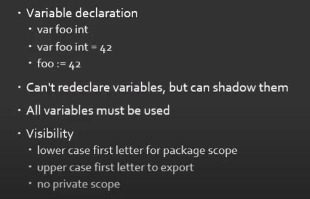
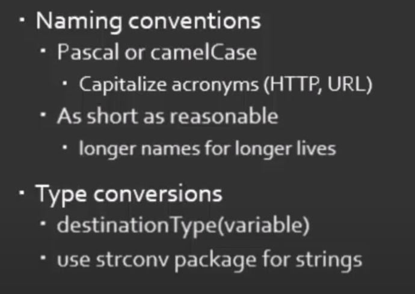

# Golang tutorial

*Hi there! this document contains key snippets of information that I have been able to make note of while going through a 6 hour video on the basics of Golang, the from the following [Youtube Video ](https://www.youtube.com/watch?v=YS4e4q9oBaU&ab_channel=freeCodeCamp.org).  '*

*Before starting off with exploring the code, you might want to have a look at the following [link](https://www.cyberciti.biz/faq/how-to-install-gol-ang-on-ubuntu-linux/) or follow the steps mentioned in the first part of the above video to set up Golang in your machine'*

*Once you are done setting up Golang, to quickly start off you can 'cd' to 'src/github.com/YellowDemonDhruv/firstapp/' and run the command go run Main.go'*

## Project structure

- The main code file is placed in a folder structure "github.com/YellowDemonDhruv/" so that whenever you want to fetch this app from an external target, you can use the command "go fetch github.com/YellowDemonDhruv/gocode"

- When we build a go file, using go build <filePath>, the output is a compiled binary file which can be directly run on the terminal by just typing in the file name

## Variables

### Variable definition in GOLANG

- An UPPERCASE variable is exposed to the global package scope
- Variables declared at the package level 'can be not used' throughout the program, but variables declared in any local scope of a function have to be used
- While declating pacakge level variables - we cannot use the ':=' syntax here and we have to be explicit with the keyword var and the variable type

### Type conversion in GOLANG

- while converting an integer to a type string - go just checks what is the character which contains the unicode value of that integer, For example, if you declare i = 42 and set j = string(i), then you get * as the value of j, because the character * has the unicode value of 42. So to achieve conversion between numbers and strings, we have a package in golang called as 'strconv'.
- For conversion between numeric types we need to use explicit type conversion. 

- 
- 

### Primitives

#### Complex numbers are considered as a first class citizen in golang - there is a complex32 and complex64 data type in golang

#### Boolean type
- Values are true or false
- Not an alias for other types(e.g. int)
- Zero value is false

#### Numeric types

##### Integers
- Signed integers ( both positive and negative integers )
    - int type has varying size, but min 32 bits ( the most common type of integer that we would be dealing in any application )
    - If we need more control we can use the 8bit(int8) through 64 bit(int64)

- Unsigned integers ( only positive integers )
    - 8 bit (byte and uint8 ) through 32 bit (unit32)

- Arithmetic operatons
    - Addition + , subtraction - , multiplication * , division / , remainder %

- Bitwise operations
    - And '&', or '|', xor '^' ,and not '&^'

- Can't mix types in the same family! (uint16 + uint32 = error)

##### Floating point
- 32 and 64 bit versions

- Literal styles
    - Decimal(3.14)
    - Exponential(12e18 or 12E10)
    - Mixed(12.5e15)

- Arithmetic operations
    - Add, sub, mul, div, <s>remainder</s>

##### Complex number
- Zero value is 0 + 0i

- Built up from float numbers ( 32 or 64 ) 

- These numbers have a 64 or 128 bit versions based on what they are built up of

- Built in functions
    - complex() - make complex number(64, 128) from 2 floats(32, 64)
    - real() - get the real part as a float
    - imag() - get the imaginary part as a float

#### Text types

##### Strings
- UTF-8
- Immutable
- Can be concatenated with the + operator
- Can be converted to []byte

##### Rune
- UTF-32
- ALias for int32
- Special methods normally required to process
    - E.g. [strings.Reader#ReadRune](https://golang.org/pkg/strings/#Reader.ReadRune)